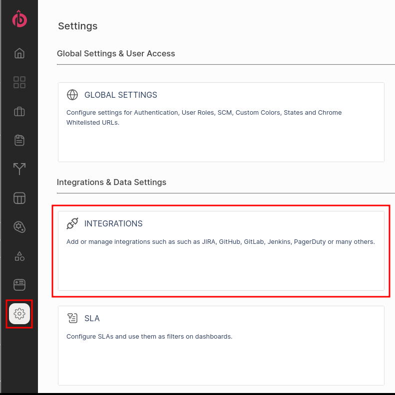
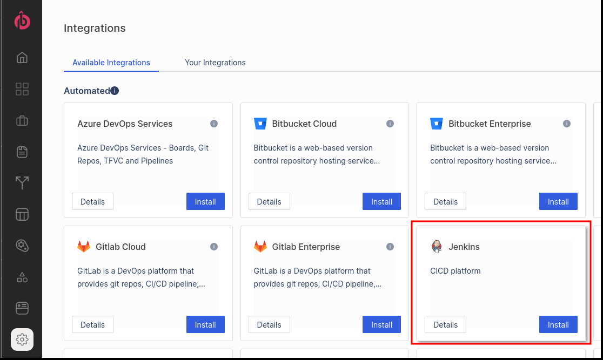
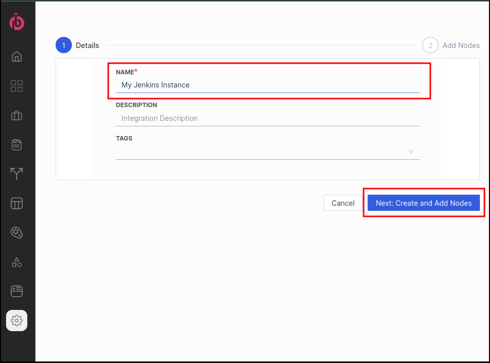
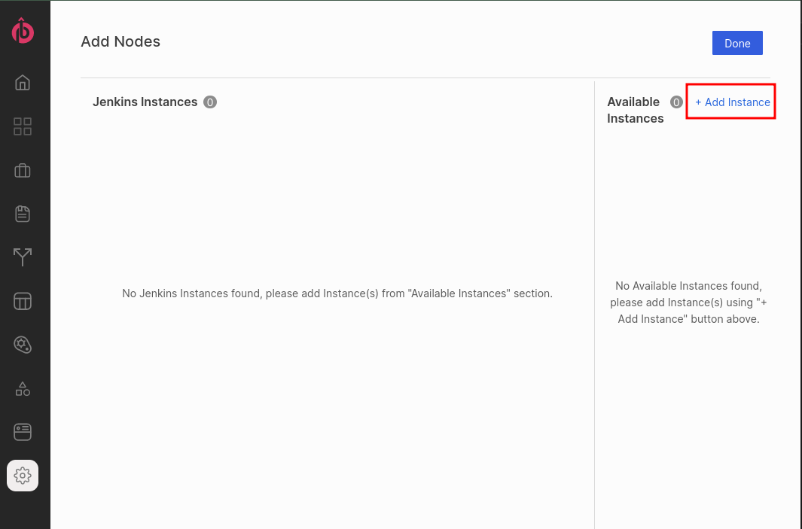

# propelo-job-reporter
Propelo's Jenkins Plugin to send reports about jobs' logs and metadata to the Propelo Service.
 
 
 

# Installation

### Installation pre-requirements
---
1. Have a Propelo account with permissions to add an integration.
2. Have access and permissions to install plugins in Jenkins.

 
 

### Instalation Steps
---
1. Login to your Propelo account
2. Access the Integrations Settings Tile. 

  > 

3. Add a new Jenkins integration

  > 
  > 
  > 

4. Install the plugin

5. Configure the plugin

 
 
 

# Contributing
 

## Build
---
- Maven
  > Steps:
  > - Build command: `mvn install`
  >
  > - This creates an `hpi` file that can be uploaded to Jenkins:  
  > `target/propelo-job-reporter.hpi`
  >  
  > Notes:
  > - Use Java 8 to build otherwise there will be some issues with Javadoc step, e.g.:  
  >
  >       JAVA_HOME=/usr/lib/jvm/java-8-openjdk-amd64 mvn install

 

- Gradle
  > Steps:
  > - Build command: JAVA_HOME=/usr/lib/jvm/java-8-openjdk-amd64 ./gradlew clean build
  >  
  > - This creates an `hpi` file that can be uploaded to Jenkins:  
  > `build/libs/propelo-job-reporter.hpi`
  > 
  > Notes:
  > - Use Java 8 to build otherwise there will be some issues with Javadoc step, e.g.:  
  >
  >       JAVA_HOME=/usr/lib/jvm/java-8-openjdk-amd64 ./gradlew clean build

***The findbugs step may fail (skipTests=true doesn't seem to work) but anaways runs after the build has been created***

 
 

## Deploy
---

- Add Plugin: go to Manage Plugins > Advanced > Upload Plugin
http://jenkins-host/pluginManager/advanced 

Testing
-------

> **Test while developing**
>
>       JENKINS_HOME=jenkins-job-reporter/work ./gradlew clean server
>
>       JENKINS_HOME=jenkins-job-reporter/work JAVA_HOME=/usr/lib/jvm/java-8-openjdk-amd64 ./gradlew clean server  
>
>       GRADLE_OPTS=-agentlib:jdwp=transport=dt_socket,server=y,suspend=n,address=5005 JENKINS_HOME=jenkins-job-reporter/work JAVA_HOME=/usr/lib/jvm/java-8-openjdk-amd64 ./gradlew clean server  

> **Run Jenkins docker image:**  
>  1. Blue Ocean Jenkins 
>  
>         https://hub.docker.com/r/jenkinsci/blueocean/
>  
> 2. Officcial jenkins docker (lts or any specific version)
> 
>        docker run -d --name jenkins-dev -p 8080:8080 -p 50000:50000 --mount "type=bind,source=/<base path>/data/jenkins_dev,target=/var/jenkins_home" --env JAVA_OPTS=-Dhudson.footerURL=https://levelops.io jenkins/jenkins:lts

- Run integration test class over Wiremock provided in resources

 
 

## Develop
---

Jelly UI: https://wiki.jenkins.io/display/JENKINS/Jelly+form+controls

### Knowledge Base
---

- Adding Plugin Manually return error "413 Request Entity Too Large".  
    This is a known issue with Jenkins Nginx default settings.  
    Solution: Increase client max body size limit in Nginx config
    1. Edit Nginx config  
        <pre><code>vi /etc/nginx/nginx.conf</code></pre>  
    2. Add the following line to http or server or location context to increase the size limit  
        <pre><code>\# set client body size to 20M \#  
        client_max_body_size 20M;</code></pre>  
    3. Restart Nginx service
        <pre><code>service nginx reload</code></pre>
    References:  
    Link to [Jenkins Bug](https://issues.jenkins-ci.org/browse/JENKINS-32575 "Jenkins Bug").  
    Link to [solution instructions](https://www.cyberciti.biz/faq/linux-unix-bsd-nginx-413-request-entity-too-large "solution instructions").  
    Link to [Jenkins Gradle Plugin](https://plugins.gradle.org/plugin/org.jenkins-ci.jpi)  
    Link to [Jenkins Gradle Plugin - GitHub](https://github.com/jenkinsci/gradle-jpi-plugin)  
